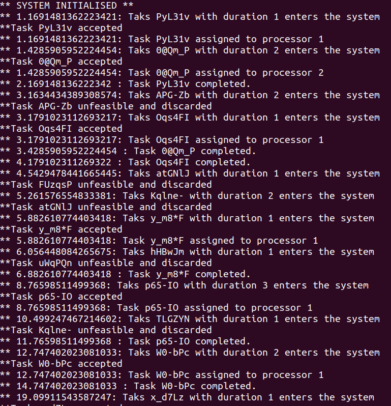

# Simulated-System-Python

**Please use Python3**

**run Data.py firstly, then running System.py**

**RESULT**

#Simulation Data

The data required to run the simulation represents different tasks that need
to be carried out by a processor. Each task is characterised by the following
properties.

ID : A string of six characters. Each character is randomly chosen (uniform
probability) from letters (’a’-’z’ and ’A’-’Z’), digits (’0’-’9’) and some
special characters (’@’, ’ ’, ’#’, ’*’, ’-’, and ’&’).

Arrival : A random real value generated by a uniform distribution from 0
to 100.

Duration : A random value generated by an exponential distribution of
parameter 1, rounded up.

#Simulated System

The system is comprised of a clock and three identical processors.
At the beginning, the clock is set to zero and the processors are not
busy and are, therefore, available. The following message is displayed in the
console:

** SYSTEM INITIALISED **

As the clock advances, the tasks enter the system at their specified arrival
time. In the rare eventuality of multiple tasks arriving at the same time,
the processing order is indifferent and the tasks are processed one at the
time. Without loss of generality, from now on it is assumed that only one
task enters the system.

When a task enters the system, the following message is displayed:

2** [CLOCK] : Task [TASK ID] with duration [TASK DURATION] en-
ters the system.

where [CLOCK] is the current clock’s value, [TASK ID] is the incumbent
task’s ID and [TASK DURATION] is its duration.
Next, the system checks the ID of the entering task. If the ID does not
satisfy at least 3 of the following rules, the task is automatically discarded:

• At least one lowercase letter.
• At least one uppercase letter.
• At least one digit.
• At least one among the special characters.

If a task is discarded, the following message is displayed:

** Task [TASK ID] unfeasible and discarded.

Otherwise, if the task’s ID passes the filter, the following message is dis-
played:

** Task [TASK ID] accepted.

Then, the task needs to be assigned to a processor. If a processor is
available, then the task is assigned to it, the processor is busy for the whole
duration of the task and it becomes available when it ends. Otherwise,
the task must be put on hold and assigned to the first available processor
according to a FIFO strategy.

When a task is put on hold the message displayed is:

** Task [TASK ID] on hold.

On the other hand, when a task is assigned to a processor the following
message is displayed:

** [CLOCK] : Task [TASK ID] assigned to processor [PROCESSOR #].

where [PROCESSOR #] is the processor number, i.e., either 1, 2 or 3.
When a task is completed, the message displayed is:

3** [CLOCK] : Task [TASK ID] completed.

Finally, when all the tasks have been processed and completed, the sim-
ulation ends and the following message is displayed:

** [CLOCK] : SIMULATION COMPLETED. **
